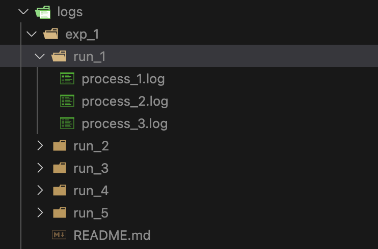

# Implementation Design Notes

## Key files

All our distributed system + experiment code is located in the [system/](../system/) folder.

- [system/main.py](../system/main.py): Main program for running experiments with virtual machines.
  - This will run multiple experiments, each of which instantiate 3 virtual machines and log events for a set duration.
  - `NUM_RUNS_PER_EXP`, the number of runs per experiment configuration (default: 5), and `EXPERIMENT_DURATION`, how long each experiment lasts in seconds (default: 60), are adjustable parameters in this file.
- [system/machine.py](../system/machine.py): Contains VirtualMachine class that initiates one machine in our distributed system.
- [system/logging.py](../system/logger.py): Contains helper functions to log events while the virtual machines are running.
- [system/analyze_logs.py](../system/analyze_logs.py): Computes + visualizes statistics from event logs to compare drift, jumps in logical clock steps, and message queue lengths across different experiment confirmations.
  - Figures will be saved in the [system/figures/](../system/figures/) folder, in experiment-specific subfolders.

## Sockets

All messages are sent over sockets. The port numbers to use are established in a configuration file. The process code is identical; each process is started with one command-line argument establishing its number (1, 2, or 3). From this, it can determine what port number to open a socket on by indexing into the list of port numbers.

## Socket Protocol

Each message is a 4-byte integer containing the sending process's logical clock value.

## Logging

Log files are written to a [system/logs/](../system/logs/) folder. A subfolder is created for each new experiment, with a subfolder insde that corresponding to each run with one `.log` file per machine.

- For example, the log folder for Experiment 1 will be organized as follows:

All logged messages are prefixed with the process's number, taken from the command line argument passed at startup, e.g. `1> [log message]`. Each message contains the following information:

- `Process ID`: corresponding to machine 1, 2, or 3
- `Event Message`: message describing the event that occured
- `System Time`: the global time taken from the system
- `Logical Clock`: the time taken from this machine's logical clock
- `Queue Length`: current length of this machine's message queue

## Clock Rate

Clock rates (between 1 and `MAX_CLOCK_RATE` operations per second) are randomly generated at startup time and logged at that time.

- By default, `MAX_CLOCK_RATE = 6`. This is adjustable in [config.json](../config.json) to change how much variation there is in the clock cycles of the three virtual machines.

## Threads

Each process runs a listening thread (which listens for messages on the sockets and then adds them to an internal queue) and a processing thread (which follows the message processing specification from the assignment description and then sleeps for `1/[clock rate]` seconds).

## Synchronization

The message queue must not allow simultaneous access from multiple threads.

## Event Types

When there are no messages in a machine's queue, the machine generates a random number `n` in the range of 1 - `MAX_EVENT_NUM` to determine what event should occur. See [system/machine.py](../system/machine.py) for more details.

- Events are currently defined as follows:
  - If `n=1`: the machine sends a message to one of the other machines.
  - If `n=2`: the machine sends a message to the other machine.
  - If `n=3`: the machine sends a message to both machines.
  - If `3 < n <= MAX_EVENT_NUM`: this is taken as an internal event and only the logical clock is updated.
- By default, `MAX_EVENT_NUM = 10`. This is adjustable in [config.json](../config.json) to change the probability of an internal event.
